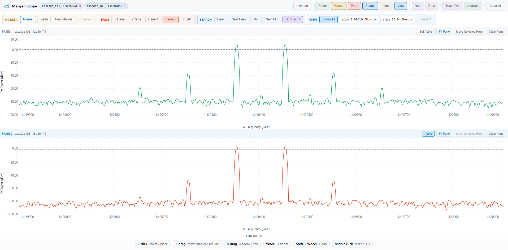

# Mergen Scope

<p>
  
</p>

[](https://alpgoxd.github.io/mergen-scope/)
[](LICENSE)

Mergen Scope is a free, open-source, browser-based viewer for Rohde & Schwarz spectrum analyzer `.dat` files. Visualize RF spectrum data, waveforms, and spectral measurements online with no installation required.

[**Open the viewer**](https://alpgoxd.github.io/mergen-scope/)



---

## Features

- Multi-trace support: load and compare multiple measurements
- Interactive markers: place markers, search for peaks and minima, track frequency points
- Trace Ops panel: create derived traces without changing the raw source
- Multi-pane view: switch between 1 and 4 stacked panes with shared X navigation
- Offset and Scale: additive or multiplicative amplitude correction as derived traces
- Smoothing: None, Moving Average, Median Filter, and Savitzky-Golay
- Trace Math: `A + B`, `A - B`, `A * B`, `A / B` with overlap-only math on A's grid
- Interpolation control for trace math: Auto, Exact only, Linear, Nearest, Previous, Next, Cubic spline
- Trace Math warnings: short unit-aware warning notes for logarithmic and mixed-logarithmic math, with no blocking and no automatic unit conversion
- Noise PSD panel: visualize noise power spectral density across the spectrum
- IP3/TOI measurement tool: marker-driven intermodulation point calculation
- Expanded analysis toolkit: peak/spur table, marker delta table, range statistics, bandwidth helper, threshold crossings, ripple/flatness, occupied bandwidth, and guarded channel power
- Zoom and pan: navigate large frequency ranges with oscilloscope-style division readout
- Saved results: keep Noise PSD and IP3 results inside the current workspace
- Workspace import/export: save and reopen complete sessions as portable JSON
- Data export: download raw traces, derived traces, current Noise PSD analysis trace, and saved analysis results as JSON
- Chart export: capture the current chart view as PNG or SVG
- No installation required: runs in any modern browser
- No CDN dependencies: all libraries are vendored locally and work offline

---

## Supported File Formats

| Format | Instruments | Notes |
|--------|-------------|-------|
| R&S semicolon-delimited `.dat` | Rohde & Schwarz instruments | Tested |
| Amplitude-only `.dat` | R&S instruments | Frequency reconstructed from metadata |

---

## Getting Started

### Local Use

```bash
git clone https://github.com/AlpGoXd/mergen-scope.git
```

Open `mergen_scope.html` directly in a modern browser. No build step and no install.

### GitHub Pages Deployment

Push to `main`. GitHub Actions deploys automatically via `.github/workflows/deploy-pages.yml`.

---

## Usage

### Loading a File

Click **Load File** and select a `.dat` export from your spectrum analyzer. Use **Append** to add more traces.

### Workspace Sessions

Use **Save Workspace** to export the current session as JSON, including imported files, derived traces, pane layout, zoom state, markers, reference lines, and saved analysis results.

Use **Open Workspace** to restore a previously exported session in one step.

### Data and Chart Export

Use **Export Data** to download the current traces as JSON, including raw traces, derived traces, the current Noise PSD analysis trace when available, and saved Noise/IP3 results.

Use **PNG** or **SVG** to export the current chart view as an image.

### Markers and Peak Search

Click the chart to place a marker. Select a marker to make it active, then use **Peak**, **Next Peak**, **Min**, or **Next Min** to move it to signal features.

### Trace Ops

Open **Trace Ops** to create derived traces from existing traces:

- **Offset** adds a constant value
- **Scale** multiplies by a constant factor
- **Smoothing** supports None, Moving Average, Median Filter, and Savitzky-Golay
- **Trace Math** supports `A + B`, `A - B`, `A * B`, `A / B`

Trace Math works over the overlapping X range only, uses A's grid, and offers interpolation control for mapping trace B onto A.

Trace Math also shows short warning-only notes when logarithmic units can make the result misleading. That includes same-unit logarithmic math such as `dBm + dBm`, `dB * dB`, and mixed logarithmic-unit math such as `dB * dBm`. These notes do not block the operation and do not change the math.

### Multi-Pane

Use the **Pane** controls to switch between:

- **1 Pane** for the current single-chart workflow
- up to **4 stacked panes** for shared-X comparison with independent Y scaling

In multi-pane mode you can:

- set the active pane
- add or remove panes
- move the selected trace to any pane
- drag a trace row from the sidebar and drop it onto a pane header or pane body
- fit the current pane
- fit all panes
- clear one pane by moving its traces back to another pane

Current first-release behavior:

- X zoom and pan are shared across panes
- Y zoom and fit are pane-local
- marker search follows the active pane and its selected trace
- reference lines are pane-local by default, with an optional lock mode to place linked lines across all panes

### Noise PSD

Open the **Noise PSD** panel, set the resolution bandwidth, and the tool computes noise power spectral density from the selected trace.

### IP3 / TOI Measurement

Assign marker roles (F1, F2, IM3L, IM3U) using the marker panel, then compute IP3 from the marked points.

### Analysis

Open **Analysis** to access pane-aware numeric tools that act on the selected trace in the active pane over the currently visible range:

- **Peak / Spur Table**
- **Marker Delta Table**
- **Range Statistics**
- **3 dB / 10 dB Bandwidth**
- **Threshold Crossings**
- **Ripple / Flatness**
- **Occupied Bandwidth**
- **Channel Power** with strict unit gating

---

## Supported File Shape

Typical R&S semicolon-delimited export:

```text
; R&S Export
Values;1001
StartXAxis;1000000;Hz
StopXAxis;3000000000;Hz
RBW;3000;Hz

Trace 1;
Trace Mode;CLR/WR
Detector;RMS
1000000;-80.5
1030000;-79.2
...
```

---

## Architecture

No build step. The app still runs directly in the browser from GitHub Pages using local vendored runtime files under `vendor/`.

The main UI stays in `mergen_scope.html`, and shared helper logic is now starting to move into local helper files under `app-modules/` so the codebase can keep growing without a framework rewrite.

`mergen_scope.html` is still the main runtime entrypoint and orchestration file. It intentionally still owns the more fragile interactive paths:

- React app state
- top toolbar and sidebar wiring
- chart rendering
- marker placement and dragging
- reference line placement and dragging
- pane activation and chart interaction handoff
- app-level import/reset flows

The helper split is meant to keep pure logic out of that file without forcing a risky rewrite. The current rule is:

- keep direct file-open support
- keep GitHub Pages compatibility
- keep local plain scripts attached to `window`
- move pure/model/helper-heavy blocks first
- avoid aggressively splitting the chart interaction core until interfaces are clearer

Current helper split:

- `app-modules/trace-helpers.js` for chart/window helpers
- `app-modules/trace-model.js` for trace identity, units, and axis-label helpers
- `app-modules/trace-ops-helpers.js` for smoothing, interpolation, and trace-math helpers
- `app-modules/analysis-helpers.js` for Noise PSD, IP3 math, and saved-result shaping helpers
- `app-modules/analysis-target-helpers.js` for pane-aware analysis registry, target resolution, and unit gating
- `app-modules/range-analysis-helpers.js` for range stats, crossings, bandwidth, OBW, and channel-power math
- `app-modules/file-store-helpers.js` for trace normalization, dedupe, and file-signature helpers
- `app-modules/parser-helpers.js` for nearest-point lookup and R&S `.dat` parsing helpers
- `app-modules/marker-helpers.js` for IP3 marker-role helpers and peak/min search math
- `app-modules/derived-state-helpers.js` for derived-trace dependency cleanup helpers
- `app-modules/ui-helpers.js` for formatting, theme colors, metric rows, and saved-result item components
- `app-modules/pane-helpers.js` for pane ownership, per-pane trace filtering, and pane Y-domain helpers
- `app-modules/workspace-helpers.js` for workspace snapshot normalization, demo preset restoration, and session import/export payload helpers
- `app-modules/export-helpers.js` for chart export rendering and trace/data export package helpers

The app now has a practical raw-vs-derived trace model:

- imported files create immutable raw traces
- Trace Ops creates derived traces
- derived traces keep source-trace references plus operation metadata
- current derived operations include offset, scale, smoothing, and trace math

Current multi-pane model:

- 1 to 4 stacked panes
- shared or pane-local X navigation depending on the `Zoom All` toggle
- independent Y scaling per pane
- pane-local active trace
- pane-local reference lines by default, with optional linked lock mode
- marker and analysis actions act on the selected trace in the active pane

Current sync philosophy:

- no permanent synchronized pane cursor line
- no always-on shared vertical guide line
- future pane synchronization should prefer marker-linked sync or hover-linked readout sync when needed, not a forced global cursor

---

## Roadmap

Current status:

- Phase 3 is complete
- Phase 4 is complete
- next work should focus on the remaining phases in order, starting with Phase 5

Roadmap in order:

1. First usable multi-pane release
   Status: completed
2. Expanded analysis toolkit
   Status: completed
3. Export and session portability
   Status: completed
   Implemented: workspace/session JSON export and import, trace/data export, saved analysis export, and chart PNG/SVG export
4. Touchstone import support
5. Touchstone measurement tools
6. Performance and scaling pass
7. Oscilloscope waveform support

Not planned right now:

- a permanent synchronized pane cursor
- an always-on shared pane guide line

---

## Known Limitations

- Only tested with R&S `.dat` exports. Other formats may need parser adjustments
- Multi-pane is currently limited to 1 to 4 stacked panes
- Touchstone support is intentionally deferred to a later format-expansion phase
- Oscilloscope waveform support is intentionally deferred to a later format-expansion phase
- Pane synchronization does not use a permanent shared cursor line
- Channel power is intentionally gated unless the trace unit is explicit spectral power density such as dBm/Hz or dBW/Hz
- No PWA / offline install support
- Large trace files (>10k points) may affect chart performance

---

## Why I Built This

I'm an EE engineer. Like most of us, I don't have time to go deep into React or the rest of the web stack. That's not what I do. But when I went looking for something simple to visualize spectrum analyzer exports and other waveform files in the browser, I couldn't find anything that fit. So I vibecoded this into existence.

Right now it's only been tested with Rohde & Schwarz `.dat` files, but the goal is to eventually open any type of waveform or instrument export file, online, with no software to install.

Feel free to open issues, suggest changes, and help make this tool better. The aim is to keep it as dependency-free as possible and useful for day-to-day measurement work.

---

## Contributing

Open an issue or submit a pull request. When testing changes, verify against the regression checklist in the HTML comment at the top of `mergen_scope.html`.

---

## License

GNU GPL-3.0-only. See [LICENSE](LICENSE).

---

## Contact

**Alp Gokalp** - RF/Microwave Engineering, Analog IC Design

[GitHub](https://github.com/alpgoxd) | [alpgokalp@hotmail.com.tr](mailto:alpgokalp@hotmail.com.tr)
